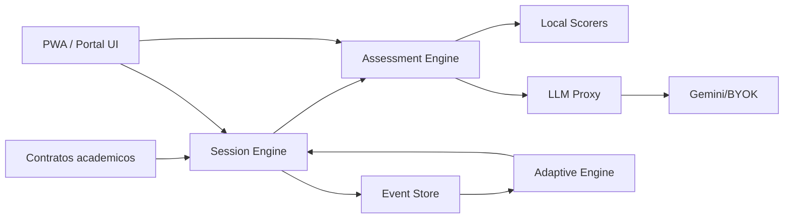

# Arquitectura objetivo



## Runtime actual

```text
public/app.js -> server.js -> data/subjects + src/scoring.js + data/runtime/events.jsonl
```

## Runtime futuro

```text
PWA -> API Gateway -> Auth -> Session Store -> Assessment Service -> Provider Router -> Event DB
```

## Regla de seguridad

No colocar claves LLM en frontend. Las cuentas Google/BYOK pueden ser honestas solo si el usuario autoriza y la clave/token se maneja por backend o flujo OAuth seguro. Nunca por HTML plano.

## Regla academica

Cada item debe etiquetarse como:

- `observed`;
- `corpus-grounded`;
- `inferred`.

Nada inferido debe presentarse como parcial observado.

