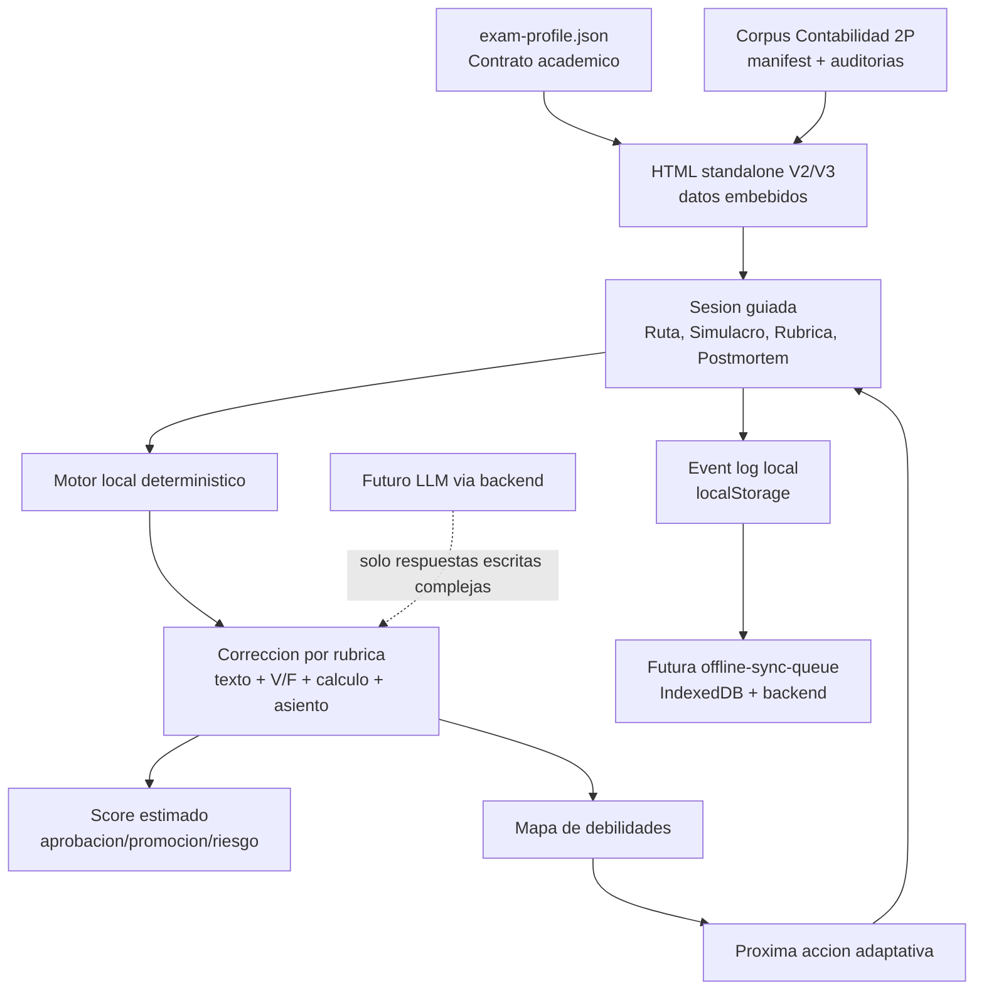
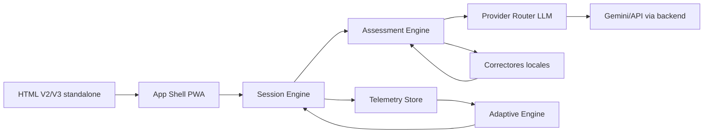

# NEXUS - memoria final de consolidacion y prototipo urgente de Contabilidad

Fecha: 2026-06-03.

## Decision operativa

Se acepta una etapa puente con HTML standalone para Contabilidad porque existe necesidad operativa urgente. Esta etapa no contradice la arquitectura futura si el HTML se construye como una simulacion fiel del contrato real:

```text
Contrato academico -> motor local -> interfaz cognitiva -> eventos -> evaluacion -> postmortem
```

La arquitectura definitiva sera modular, PWA y backend-first. El HTML urgente es un prototipo de integracion real, no el destino final.

## Objetivo del primer prototipo

Construir un simulador de segundo parcial de Contabilidad que permita estudiar y ensayar con el formato esperado:

- capa de aprendizaje previa;
- conceptos minimos por bloque;
- errores frecuentes;
- micro-chequeos cognitivos;
- desarrollo escrito;
- verdadero/falso con justificacion;
- calculo;
- asiento contable;
- desarrollo tecnico;
- caso integrador;
- correccion por rubrica local;
- estimacion de nota;
- postmortem por debilidad;
- evidencia de que bloque fue `corpus-grounded` o `inferred`.

## Principio de diseno

El alumno no debe enfrentar una biblioteca de contenidos. Debe enfrentar una sesion guiada:

```text
Que tengo que hacer ahora?
Por que el sistema me lo pide?
Como se corrige?
Que fallo?
Que entreno despues?
```

## Diagrama del puente HTML



## Diagrama de migracion futura



## Lo que se rescata

1. `CONT_2do_parcial_simulador_sovereign_V1.html`: base operativa ya funcional.
2. `Materiales/CONTABILIDAD_2P/exam-profile.json`: contrato academico inicial.
3. `Materiales/CONTABILIDAD_2P/corpus/AUDITORIA_COBERTURA.md`: cobertura corpus-grounded.
4. `Materiales/CONTABILIDAD_2P/AUDITORIA_MODELOS_PRESENCIALES.md`: honestidad sobre ausencia de modelos reales observados.
5. `docs/NEXUS_GEMINI_CTO_MEMORIA_2026-06-03.md`: LLM por backend, BYOK honesto, sin claves en frontend.
6. `docs/NEXUS_SOVEREIGN_TRANSPORTABILIDAD_CONSOLIDADO_2026-06-03.md`: doctrina transportable.

## Diferencia entre V1 y V2 urgente

| Area | V1 | V2 urgente |
|---|---|---|
| Objetivo | Simulador standalone local | Prototipo de integracion real |
| Contrato | Implicito | Visible y versionado |
| Flujo | Navegacion por secciones | Sesion guiada: aprender -> rendir -> corregir -> postmortem |
| Aprendizaje | Parcial: ruta y modelo | Capa explicita con conceptos, formulas, errores y micro-chequeos |
| Feedback | Rubrica local | Rubrica local + mapa de debilidades |
| Telemetria | Guardado local | Event log local exportable |
| LLM | Postergado | Estado `local`, `llm-pending` futuro |
| Mobile | Funcional | Mobile-first con drawer y accion primaria |
| Auditoria | Aviso general | Etiquetas `corpus-grounded`, `inferred`, `local-only` |

## Contrato minimo del prototipo

```json
{
  "prototype": "CONT_2P_SOVEREIGN_V2_URGENTE",
  "subject": "contabilidad_2p",
  "delivery": "html_standalone",
  "architectureBridge": true,
  "assessment": {
    "totalPoints": 10,
    "passPoints": 6,
    "promotionPoints": 8
  },
  "engines": {
    "localRubric": true,
    "calculationChecker": true,
    "entryBalanceChecker": true,
    "llmBackend": "future"
  },
  "events": [
    "session_started",
    "answer_saved",
    "exam_scored",
    "weakness_detected",
    "model_answers_viewed",
    "event_log_exported"
  ]
}
```

## Politica de evaluacion

Para esta etapa:

- Lo calculable se corrige localmente.
- Lo escrito se corrige por predicados tecnicos, no por cita textual.
- Las contradicciones criticas restan.
- La nota es estimada, no reemplaza correccion docente.
- El caso integrador se etiqueta como `inferred` hasta recibir parciales reales de Contabilidad.

## Modo de uso recomendado

1. Abrir la ruta guiada.
2. Estudiar la capa `Aprender`.
3. Responder oralmente los micro-chequeos.
4. Resolver el simulacro sin mirar respuestas.
5. Corregir.
6. Leer postmortem.
7. Rehacer el bloque mas debil.
8. Exportar bitacora si se quiere analizar progreso.

## Correccion doctrinal agregada

Feedback de uso: una herramienta que muestra respuestas pero no enseña que aprender falla como sistema cognitivo.

Resolucion en V2:

- Nueva vista `Aprender`.
- Tarjetas por bloque: devengado, V/F, remuneraciones, auditoria, control interno y escritura tecnica.
- Micro-chequeos antes del simulacro.
- Respuestas modelo relegadas a uso posterior al intento/correccion.
- Postmortem redirige primero a aprendizaje y despues a reintento.

## V3 Misiones

La V3 convierte el prototipo en un recorrido para alguien que nunca uso NEXUS. La secuencia deja de depender de que el alumno entienda la interfaz y pasa a operar como metodo:

```text
Inicio -> Aprender -> Entrenar -> Simulacro -> Correccion -> Postmortem -> Auditoria
```

Cambios centrales:

- Inicio explica por que se eligieron los temas: devengado, V/F justificado, remuneraciones, asiento, auditoria y control interno.
- Aprender incluye seis tarjetas de criterio, no respuestas sueltas.
- Entrenar valida micro-habilidades antes de exponer al alumno al simulacro.
- Simulacro mantiene formato escrito, calculo, asiento y caso integrador.
- Correccion produce nota estimada por bloque.
- Postmortem transforma la debilidad en mision de reentrenamiento.
- Auditoria conserva eventos locales exportables para futura telemetria.

Contrato V3:

```json
{
  "prototype": "CONT_2P_SOVEREIGN_V3_MISIONES",
  "subject": "contabilidad_2p",
  "delivery": "html_standalone",
  "method": "mission-guided-learning",
  "sequence": [
    "inicio",
    "aprender",
    "entrenar",
    "simulacro",
    "correccion",
    "postmortem",
    "auditoria"
  ],
  "learningLayer": {
    "cards": 6,
    "examMapped": true,
    "answerFirst": false
  },
  "assessment": {
    "totalPoints": 10,
    "passPoints": 6,
    "promotionPoints": 8
  },
  "engines": {
    "localRubric": true,
    "calculationChecker": true,
    "entryBalanceChecker": true,
    "llmBackend": "future"
  }
}
```

Verificacion V3 realizada:

- render inicial: correcto;
- seis tarjetas de aprendizaje: correcto;
- entrenamiento con respuestas correctas: 100%;
- simulacro fuerte: 9.47 / 10, promocion estimada;
- postmortem: genera mision de reentrenamiento;
- auditoria: registra eventos locales.

## Riesgos abiertos

1. Todavia faltan modelos reales de parciales de Contabilidad.
2. El corrector escrito local no entiende sinonimia profunda como un LLM.
3. El HTML mantiene localStorage como puente, no como backend definitivo.
4. No debe enviarse informacion personal al prototipo.
5. La arquitectura real debe migrar a PWA modular + backend/proxy LLM.

## Dictamen

El HTML V2 urgente es justificable porque resuelve una necesidad operativa inmediata y permite validar la experiencia real de examen. Para no repetir errores viejos, debe nacer con contratos, eventos, auditoria y etiquetas de evidencia. Asi el prototipo no se vuelve deuda: se vuelve una prueba concreta del sistema futuro.
