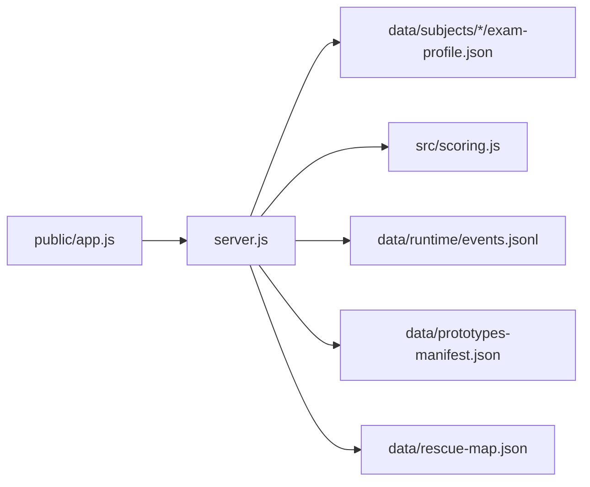
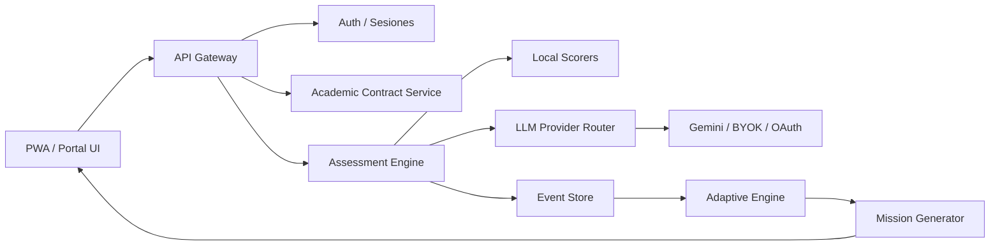

# NEXUS Study Cockpit - Consolidado de producto y arquitectura

Fecha: 2026-06-04  
Producto: NEXUS Study Cockpit  
Runtime interno: SOVERINGBACKEND  
Estado: cockpit operativo para validar aprendizaje adaptativo, scoring y arquitectura futura.

---

## 1. Problema que resuelve para el estudiante

Un estudiante llega, elige una materia, hace un intento de examen real o modelo fiel, recibe correccion, score y proxima mision en minutos.

El valor no es "tener backend". El valor es que el alumno deja de estudiar a ciegas:

- sabe que temas le toman;
- practica con formato parecido al parcial;
- recibe una nota estimada;
- ve que huecos tecnicos le bajan puntos;
- reentrena lo que falla;
- llega al simulacro final con evidencia de preparacion.

La promesa de producto:

```text
Menos tiempo perdido, mas precision para aprobar.
```

---

## 2. Usuario, flujo y resultado esperado

Usuario principal:

```text
Alumno FCE que tiene poco tiempo, material disperso y necesita aprobar un parcial presencial escrito.
```

Flujo ideal:

1. Elige materia.
2. Ve que bloques entran en el parcial.
3. Estudia una mision corta.
4. Resuelve un intento escrito o numerico.
5. Recibe score por bloque.
6. Reentrena la debilidad dominante.
7. Hace simulacro completo.
8. Compara score estimado contra nota real.

Resultado esperado:

```text
El alumno sabe antes del parcial si esta en zona de riesgo, aprobacion o promocion.
```

---

## 3. Criterio de exito medible

La metrica norte del cockpit es:

```text
Calibracion de aprobacion: el score estimado debe quedar a +/- 1 punto de la nota real en al menos 70% de los casos piloto.
```

Target futuro:

```text
80% de calibracion cuando haya mas parciales reales y mas alumnos.
```

Metricas secundarias:

- Tiempo hasta primer intento: un alumno nuevo debe corregir su primer intento en menos de 5 minutos.
- Latencia de feedback: correccion local en menos de 3 minutos; correccion LLM futura en menos de 8 minutos.
- Deteccion de huecos: al menos 80% de los errores del parcial real deben aparecer antes como debilidades o misses del sistema.
- Mejora por ciclo: despues de dos ciclos intento -> feedback -> reentrenamiento, el alumno deberia subir al menos 1 punto o mejorar 30% el bloque debil.
- Foco de estudio: al menos 60% del tiempo dentro del sistema debe ir a debilidades detectadas, no a repaso generico.
- Friccion mobile: un alumno en celular debe entender el recorrido sin explicacion externa.

Equivalente a Fitness:

```text
Asi como en Fitness el criterio eran las ediciones reales de Ariel, aca el criterio son nota real, huecos reales y mejora real despues de usar el cockpit.
```

Sin estas metricas, la interfaz puede verse moderna, pero no prueba aprendizaje.

---

## 4. Naming de producto

`SOVERINGBACKEND` no debe ser el nombre visible del producto. Es nombre interno de plomeria tecnica.

Nombre de producto recomendado:

```text
NEXUS Study Cockpit
```

Alternativas:

- NEXUS Exam Cockpit;
- NEXUS Parcial Lab;
- NEXUS Study OS.

Decision:

```text
Producto visible: NEXUS Study Cockpit.
Runtime/carpeta/backend: SOVERINGBACKEND.
```

Esto evita vender "backend" cuando el valor real es entrenamiento, correccion y prediccion de aprobacion.

---

## 5. Resumen tecnico ejecutivo

SOVERINGBACKEND se construyo para rescatar el trabajo previo de NEXUS y sacarlo del limite del HTML monolitico.

La idea central es pasar de:

```text
HTML standalone con logica embebida
```

a:

```text
Producto educativo con backend, contratos academicos, scoring, eventos, memoria y futura capa LLM
```

El objetivo inmediato no es "tener la plataforma final", sino crear un puente serio:

- usable hoy para Contabilidad y Administracion;
- auditable por cualquier programador;
- escalable a varias materias;
- preparado para LLM real sin exponer claves;
- transportable a navegador, PWA, mobile y futuro portal.

---

## 6. Que se construyo

### 6.1 Carpeta principal

Se creo la carpeta:

```text
SOVERINGBACKEND/
```

Esta carpeta concentra:

- backend local;
- UI web de prueba;
- contratos academicos;
- corrector inicial;
- bitacora de eventos;
- prototipos rescatados;
- modulos historicos del portal;
- memorias CTO;
- documentos de arquitectura.

### 6.2 Backend local

Archivos principales:

```text
SOVERINGBACKEND/server.js
SOVERINGBACKEND/src/scoring.js
SOVERINGBACKEND/scripts/smoke.js
SOVERINGBACKEND/package.json
```

El backend actual corre con Node.js puro, sin dependencia pesada.

Endpoints disponibles:

```text
GET  /api/health
GET  /api/subjects
GET  /api/subjects/:folder/contract
GET  /api/prototypes
GET  /api/rescue-map
GET  /api/events
POST /api/events
POST /api/attempts/score
POST /api/llm/review
```

Funcion actual:

- servir la UI local;
- exponer materias;
- devolver contratos academicos;
- corregir intento de Contabilidad;
- guardar eventos;
- dejar preparado el punto de entrada LLM.

### 6.3 UI nueva de cabina

Archivos:

```text
SOVERINGBACKEND/public/index.html
SOVERINGBACKEND/public/styles.css
SOVERINGBACKEND/public/app.js
```

Se reemplazo la UI inicial, que parecia una consola tecnica, por una cabina de producto:

- topbar con identidad NEXUS;
- comando rapido;
- selector de materia;
- ruta guiada;
- cockpit central;
- contrato academico;
- lab de intento escrito;
- consola de calculo/asiento;
- rail derecho con score y senales;
- bitacora de eventos;
- mapa de rescate.

La direccion visual toma patrones de interfaces avanzadas como Linear, Raycast, Vercel y Stripe, pero sin copiar marca. El criterio no es estetica decorativa: es claridad operacional, foco de tarea y feedback inmediato.

### 6.4 Correccion de bug de producto

Problema observado:

```text
El usuario probaba un intento de Contabilidad, pero la materia activa podia quedar en Administracion.
Resultado: unsupported_subject.
```

Correccion:

```text
El lab de intento urgente fuerza subjectId = contabilidad_2p.
```

Resultado validado:

```text
score: 8.64
status: promotion_estimated
subjectId: contabilidad_2p
```

---

## 7. Materias integradas

### 7.1 Administracion

Archivo:

```text
SOVERINGBACKEND/data/subjects/administracion/exam-profile.json
```

Base:

- parciales reales observados;
- modelos T1, T2, T3, T4;
- bloques de 2 puntos;
- conceptos de sistemas;
- proceso administrativo;
- control;
- roles de Mintzberg;
- estructura, direccion, poder y autoridad.

Estado:

```text
Materia con perfil de examen observado y util para calibrar metodologia.
```

### 7.2 Contabilidad

Archivos:

```text
SOVERINGBACKEND/data/subjects/contabilidad_2p/exam-profile.json
SOVERINGBACKEND/data/subjects/contabilidad_2p/AUDITORIA_MODELOS_PRESENCIALES.md
SOVERINGBACKEND/data/subjects/contabilidad_2p/corpus/manifest.json
SOVERINGBACKEND/data/subjects/contabilidad_2p/corpus/AUDITORIA_COBERTURA.md
```

Bloques actuales:

- definicion o comparacion escrita;
- verdadero/falso con justificacion;
- calculo y asiento contable;
- desarrollo tecnico;
- caso integrador.

Familias conceptuales:

- devengado, resultado e imputacion;
- remuneraciones, aportes y contribuciones;
- patrimonio neto;
- control, control interno y auditoria;
- ejercicio profesional, incumbencias y etica.

Estado:

```text
Materia urgente en fase operativa inicial. Tiene corrector local parcial y estructura de examen.
```

---

## 8. Prototipos integrados

Carpeta:

```text
SOVERINGBACKEND/prototypes/
```

Incluye:

```text
ADM_2do_parcial_sovereign_standalone_V2.html
ADM_2do_parcial_sovereign_parciales_reales_V3.html
CONT_2do_parcial_simulador_sovereign_V2_integracion.html
CONT_2do_parcial_simulador_sovereign_V3_misiones.html
```

Rol de los prototipos:

- no son destino final;
- funcionan como evidencia de producto;
- permiten rescatar patrones de estudio;
- prueban interfaz, contenido y scoring;
- sirven como puente mientras se arma arquitectura real.

Decision CTO:

```text
Los HTML standalone validan metodo, pero no deben seguir creciendo como plataforma principal.
```

---

## 9. Rescate del portal y backend previo

Carpeta:

```text
SOVERINGBACKEND/rescue/
```

### 9.1 Proxy AI / Gemini / RAG

```text
rescue/backend-legacy/nexus-ai-proxy/
```

Piezas rescatables:

- provider Gemini;
- tutor service;
- RAG;
- carga de conocimiento;
- guardrails;
- auditoria;
- reglas doctrinales;
- feedback store.

Importancia:

```text
Esta es la base para que el LLM opere desde backend y no desde HTML.
```

### 9.2 Cola offline

```text
rescue/pwa/offline-sync-queue/
```

Importancia:

- soporta modo offline;
- permite sincronizar eventos luego;
- resuelve parte del viejo problema de transportabilidad.

### 9.3 Metodo de examen reusable

```text
rescue/exam-method/nexus_exam_method/
```

Importancia:

- schema de contrato academico;
- adaptador de contrato;
- validadores;
- plantilla reutilizable por materia.

### 9.4 Modulos del portal

```text
rescue/portal-modules/
```

Incluye:

- adaptive engine;
- quiz;
- exam;
- AI;
- fetch.

Rol:

```text
No copiar directo todo el portal. Rescatar reglas, contratos y motores utiles.
```

---

## 10. Documentos de memoria incluidos

Carpeta:

```text
SOVERINGBACKEND/docs/
```

Documentos existentes:

```text
CTO_HANDOFF.md
ARCHITECTURE.md
00_LEER_PRIMERO_MAPEO_RESCATE.md
AUDITORIA_RESCATE_SEGUNDA_PASADA_2026-06-01.md
NEXUS_MEMORIA_FINAL_Y_PROTOTIPO_CONTABILIDAD_URGENTE_2026-06-03.md
NEXUS_GEMINI_CTO_MEMORIA_2026-06-03.md
NEXUS_SOVEREIGN_TRANSPORTABILIDAD_CONSOLIDADO_2026-06-03.md
NEXUS_STUDY_COCKPIT_CONSOLIDADO_2026-06-04.md
```

Este documento consolida la vision despues de crear el backend y redisenar la UI.

---

## 11. Arquitectura actual



Runtime:

```text
Navegador local -> API local -> contratos + scoring + eventos
```

Ventajas:

- simple;
- auditable;
- barato;
- sin dependencia cloud;
- ideal para probar el puente.

Limites:

- no hay autenticacion;
- no hay multiusuario real;
- eventos en JSONL local;
- corrector escrito rudimentario;
- LLM todavia no operacional;
- no hay base de datos compartida.

---

## 12. Arquitectura objetivo



Servicios futuros:

- `Session Service`;
- `Academic Contract Service`;
- `Assessment Engine`;
- `LLM Provider Router`;
- `Event Store`;
- `Adaptive Mission Engine`;
- `Content Ingestion Service`;
- `Audit Service`;
- `Offline Sync Service`.

---

## 13. Vision de producto

NEXUS no debe competir como "otra app de quizzes".

Debe convertirse en:

```text
un sistema de entrenamiento cognitivo orientado a aprobar parciales reales con menos friccion y mayor precision.
```

Principios:

- estudiar antes de evaluar;
- entrenar como se toma el parcial;
- corregir con rubrica;
- detectar debilidades;
- reentrenar solo lo necesario;
- registrar eventos;
- usar LLM como interlocutor, no como fuente magica;
- separar contenido observado, corpus-grounded e inferido.

La unidad de producto no es una pagina.

La unidad de producto debe ser:

```text
Mision de aprendizaje -> intento -> correccion -> feedback -> reentrenamiento -> simulacro.
```

---

## 14. Vision de UI de nueva generacion

La UI futura debe abandonar el patron:

```text
sidebar + cards + texto + boton
```

y pasar a:

```text
cabina de estudio adaptativa
```

Componentes esperados:

- comando global;
- editor de respuesta;
- consola de calculo cuando la materia lo requiere;
- timeline de intentos;
- mapa de dominio;
- rail de debilidad dominante;
- coach LLM contextual;
- vista de examen;
- vista de postmortem;
- modo mobile-first;
- modo offline;
- memoria del usuario.

La interfaz debe parecer una herramienta viva, no un documento decorado.

---

## 15. Estrategia LLM y cuentas Google

Se discutio usar cuentas Google/Gemini como forma honesta de reducir costo inicial.

Criterio CTO:

```text
No poner claves ni tokens en HTML.
No exponer API keys en frontend.
No simular seguridad.
No prometer criptografia cuando solo hay ofuscacion.
```

Formas aceptables:

1. Backend con clave propia controlada.
2. BYOK real: el usuario aporta clave, pero se guarda de forma segura y revocable.
3. OAuth con proveedor, si el flujo permitido por Google/Gemini lo habilita.
4. Router de proveedores con limites, logs y costos visibles.

Formas no aceptables:

- pegar claves en HTML;
- guardar tokens en localStorage sin proteccion;
- usar cuentas de alumnos de forma opaca;
- depender de scraping de una sesion web;
- prometer seguridad que no existe.

Vision:

```text
El LLM debe ser un servicio de backend, no un widget pegado al frontend.
```

---

## 16. Transportabilidad

Problema viejo:

```text
HTML standalone era facil de mover, pero dificil de escalar.
Backend simple era funcional, pero no generaba salto de calidad.
```

Solucion futura:

- PWA instalable;
- backend remoto o local segun contexto;
- offline queue;
- sincronizacion diferida;
- cache de contratos;
- exportacion/importacion de sesiones;
- UI responsive real;
- posibilidad de empaquetar para mobile.

Modelo:

```text
Local-first donde conviene.
Cloud/LLM donde agrega valor real.
```

No mantener local-first como dogma si impide el salto de calidad.

---

## 17. Metodo multi-materia

Para convertir esto en metodo general, cada materia debe tener:

1. Corpus legible.
2. Auditoria de cobertura.
3. Perfil de parcial.
4. Familias conceptuales.
5. Bloques de evaluacion.
6. Rubrica por bloque.
7. Generador de misiones.
8. Corrector local minimo.
9. Corrector LLM supervisado.
10. Simulacro final.

Regla clave:

```text
No generar examenes sin explicar primero que debe aprender el alumno.
```

El sistema debe preparar al alumno para el examen, no solo mostrar respuestas.

---

## 18. Estado de Contabilidad

Contabilidad requiere una interfaz distinta a Administracion porque:

- tiene definiciones;
- tiene calculos;
- tiene asientos;
- tiene verdadero/falso con justificacion;
- tiene desarrollo tecnico;
- no siempre admite cita textual;
- necesita evaluar razonamiento contable.

Por eso la UI actual incluye:

- editor escrito;
- consola numerica;
- score por bloques;
- feedback de faltantes;
- contrato visible;
- eventos.

Proximo paso especifico:

```text
Convertir el prototipo urgente de Contabilidad en simulador con misiones reales:
aprender -> practicar -> corregir -> reentrenar -> simulacro.
```

---

## 19. Validaciones hechas

Se valido:

```text
node -c server.js
node -c public/app.js
node scripts/smoke.js
GET http://127.0.0.1:8788/
GET http://127.0.0.1:8788/api/health
UI demo desde navegador embebido
```

Resultado smoke:

```json
{
  "ok": true,
  "health": "SOVERINGBACKEND",
  "subjects": ["administracion", "contabilidad_2p"],
  "score": 8.64,
  "status": "promotion_estimated"
}
```

---

## 20. Roadmap recomendado

### Fase 1 - Operativa urgente

Objetivo:

```text
Hacer que Contabilidad sirva para estudiar ya.
```

Tareas:

- mejorar misiones de Contabilidad;
- cargar mas ejercicios;
- separar aprendizaje de simulacro;
- agregar explicaciones previas por bloque;
- agregar postmortem despues del intento;
- guardar historial de intentos;
- exportar resultados.

### Fase 2 - Backend real

Objetivo:

```text
Pasar de puente local a arquitectura de producto.
```

Tareas:

- base de datos;
- sesiones;
- autenticacion;
- event store real;
- provider router LLM;
- auditoria de prompts;
- ingestion de PDFs/textos;
- cache de contenido.

### Fase 3 - Multi-materia

Objetivo:

```text
Que el metodo sea portable a cualquier materia.
```

Tareas:

- schema unico de materia;
- wizard de carga de corpus;
- generador de perfil de parcial;
- rubricas por tipo de consigna;
- dashboard de cobertura;
- biblioteca de prototipos;
- validacion contra parciales reales.

### Fase 4 - Producto de nueva generacion

Objetivo:

```text
Construir una experiencia que supere plataformas de aprendizaje tradicionales.
```

Tareas:

- coach conversacional;
- misiones adaptativas;
- simulacros dinamicos;
- memoria longitudinal;
- prediccion de aprobacion;
- recomendacion de tiempo de estudio;
- modo mobile premium;
- PWA offline;
- integracion con portal.

---

## 21. Riesgos principales

### Riesgo 1: confundir prototipo con producto

Mitigacion:

```text
Usar HTML como evidencia y puente, no como arquitectura final.
```

### Riesgo 2: LLM sin control

Mitigacion:

```text
LLM solo por backend, con contratos, auditoria y trazabilidad.
```

### Riesgo 3: respuestas sin aprendizaje

Mitigacion:

```text
Cada evaluacion debe estar precedida por guia cognitiva y practica.
```

### Riesgo 4: estetica sin producto

Mitigacion:

```text
La UI debe guiar acciones concretas, no solo verse moderna.
```

### Riesgo 5: contenido inferido mal etiquetado

Mitigacion:

```text
Separar observed, corpus-grounded e inferred.
```

---

## 22. Definicion de exito del proximo prototipo

Un prototipo de nueva generacion queda aceptable si cumple las metricas de la seccion 3 y, ademas, pasa estas pruebas de producto:

- alguien que nunca lo uso entiende que hacer;
- aprende antes de ser evaluado;
- resuelve preguntas escritas;
- corrige calculos y definiciones;
- muestra por que fallo;
- recomienda la siguiente mision;
- registra eventos;
- funciona en celular;
- no depende de claves expuestas;
- puede convertirse en backend real.

---

## 23. Comando para probar hoy

Desde:

```text
C:\Users\juancruz\Downloads\PORTAL FCE\PROYECTO CODEX\portal_fce_v19.19.0\portal_v19.3.0\SOVERINGBACKEND
```

Ejecutar:

```powershell
node server.js
```

Abrir:

```text
http://127.0.0.1:8788/
```

Smoke test:

```powershell
node scripts\smoke.js
```

---

## 24. Decision CTO final

SOVERINGBACKEND debe mantenerse como:

```text
laboratorio de arquitectura real
```

No debe volver a ser:

```text
otro HTML gigante con todo adentro
```

La vision correcta es:

```text
contratos academicos + backend + eventos + LLM supervisado + UI adaptativa + multi-materia.
```

El primer uso urgente sigue siendo Contabilidad, pero la arquitectura debe nacer preparada para todas las materias.
