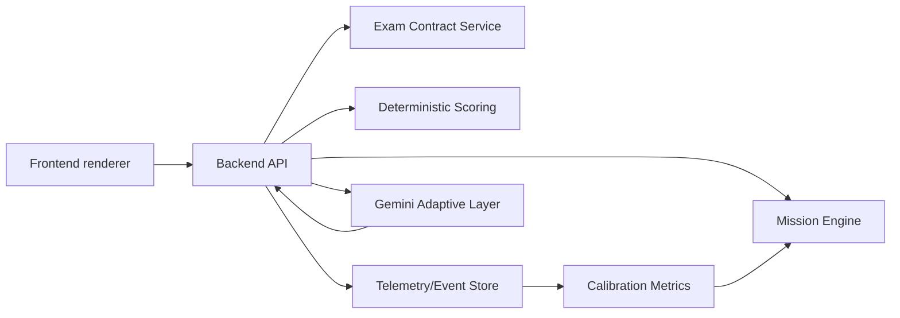

# NEXUS Study Cockpit - Relevamiento pre-implementacion

Fecha: 2026-06-04  
Estado: documento para aprobacion antes de construir codigo  
Producto: NEXUS Study Cockpit  
Runtime interno actual: SOVERINGBACKEND

---

## 1. Tesis de arquitectura

NEXUS Study Cockpit debe funcionar con un nucleo determinista auditable y una capa IA adaptativa subordinada.

```text
Backend manda.
Frontend consume.
LLM asiste.
El score se calibra contra la nota real.
```

El nucleo hace lo que puede probarse sin LLM:

- contratos de examen;
- rubricas por bloque;
- scoring determinista;
- motor de misiones;
- telemetria;
- historial de intentos;
- calibracion contra nota real.

Gemini aporta lo que el determinismo no resuelve bien:

- variedad de consignas;
- feedback conversacional;
- adaptacion al estilo de aprendizaje;
- explicaciones alternativas;
- lectura cualitativa de respuestas largas;
- deteccion de matices cuando el corrector local no alcanza.

Regla innegociable:

```text
Gemini nunca decide solo la nota final. El backend valida, registra y limita.
```

---

## 2. Problema que resuelve para el estudiante

Un estudiante llega, elige materia, hace un intento de examen real o modelo fiel y recibe correccion, score y proxima mision en minutos.

El sistema debe emancipar al alumno:

- aprende a identificar que le toman;
- aprende a responder con criterio;
- aprende a detectar sus huecos;
- aprende a estimar su preparacion;
- con el tiempo deberia necesitar menos guia, no mas dependencia.

Metrica norte:

```text
Calibracion del score estimado contra la nota real:
el score del cockpit debe quedar a +/- 1 punto de la nota real
en al menos 70% de los casos piloto.
```

Metricas secundarias:

- error medio absoluto entre score estimado y nota real;
- porcentaje de errores reales detectados antes como debilidades;
- mejora por ciclo intento -> feedback -> reentrenamiento;
- tiempo hasta primer intento corregido;
- tiempo hasta feedback;
- reduccion de dependencia del coach;
- precision de la autoevaluacion del alumno antes del simulacro.

---

## 3. Referencias: arquitectura LLM + nucleo determinista

### 3.1 Gemini structured outputs

Fuente:

- Google AI for Developers - Gemini API structured output: https://ai.google.dev/gemini-api/docs/structured-output

Que aporta:

- permite pedir respuestas con estructura controlada;
- soporta esquemas para que la salida sea parseable;
- reduce variabilidad cuando se necesita integrar LLM a backend.

Patron que adoptamos:

```text
Gemini devuelve feedback estructurado, no texto libre que el frontend interpreta.
```

Ejemplo conceptual:

```json
{
  "feedback": "...",
  "detected_misses": ["..."],
  "suggested_next_mission": "...",
  "confidence": 0.72
}
```

Lo que descartamos:

```text
No usar salida libre de Gemini como fuente de verdad.
No dejar que el frontend parsee texto natural para decidir UI, score o ruta.
```

Motivo:

La salida generativa puede variar. La estructura ayuda, pero no reemplaza validacion backend.

---

### 3.2 Gemini function calling

Fuente:

- Google AI for Developers - Gemini API function calling: https://ai.google.dev/gemini-api/docs/function-calling

Que aporta:

- el modelo puede elegir llamar funciones definidas por la aplicacion;
- la aplicacion conserva control sobre ejecucion, datos y herramientas;
- sirve para que el LLM pida acciones sin ejecutar logica critica por su cuenta.

Patron que adoptamos:

```text
Gemini puede sugerir: "necesito consultar contrato", "necesito revisar intento", "necesito generar variante".
El backend decide si ejecuta esa funcion y con que parametros.
```

Lo que descartamos:

```text
No function calling desde frontend.
No herramientas LLM que modifiquen score sin pasar por rubrica.
No usar Gemini como router absoluto de la experiencia.
```

Motivo:

La funcion critica pertenece al backend. El LLM puede pedir, pero no mandar.

---

### 3.3 LLM-as-a-judge con rubricas

Fuentes:

- Zheng et al. - Judging LLM-as-a-Judge with MT-Bench and Chatbot Arena: https://arxiv.org/abs/2306.05685
- Survey: A Survey on LLM-as-a-Judge: https://arxiv.org/abs/2411.15594

Que aporta:

- los LLM pueden evaluar respuestas abiertas con criterios;
- existen sesgos, variabilidad y problemas de consistencia;
- el judge funciona mejor como evaluador auxiliar que como verdad final.

Patron que adoptamos:

```text
LLM-as-a-judge solo como segunda lectura cualitativa.
El score base sale del nucleo determinista.
La salida del judge se registra y se compara contra nota real.
```

Lo que descartamos:

```text
No "Gemini te puso 8" como nota final sin rubrica determinista.
No usar LLM-as-a-judge sin telemetria de acuerdo contra desempeno real.
```

Motivo:

En educacion el riesgo no es solo tecnico. Un score convincente pero mal calibrado hace estudiar mal.

---

### 3.4 LLM grading en educacion

Fuente:

- npj Science of Learning - LLMs for automated feedback and grading in education: https://www.nature.com/articles/s41539-024-00291-1

Que aporta:

- los LLM pueden apoyar feedback educativo;
- la validacion contra criterios humanos y contexto pedagogico sigue siendo necesaria;
- feedback util no equivale automaticamente a medicion confiable.

Patron que adoptamos:

```text
Separar "feedback para aprender" de "score para medir".
```

Lo que descartamos:

```text
No vender feedback conversacional como equivalencia directa con correccion docente.
```

Motivo:

La confianza se gana midiendo acuerdo y calibracion, no por fluidez del texto.

---

## 4. Referencias: aprendizaje adaptativo y evidencia pedagogica

### 4.1 Active recall y retrieval practice

Fuentes:

- Karpicke & Roediger - The critical importance of retrieval for learning: https://pubmed.ncbi.nlm.nih.gov/18535228/
- Dunlosky et al. - Improving Students' Learning With Effective Learning Techniques: https://journals.sagepub.com/doi/10.1177/1529100612453266

Que aporta:

- recuperar activamente mejora aprendizaje;
- practicar pruebas tiene mas valor que releer pasivamente;
- el estudio distribuido y la autoevaluacion tienen evidencia fuerte.

Patron que adoptamos:

```text
El alumno intenta antes de ver respuesta perfecta.
El sistema corrige intentos, no solo muestra resumenes.
```

Lo que descartamos:

```text
No convertir el cockpit en biblioteca de resumenes pasivos.
No empezar por "leer todo" si el parcial exige producir respuesta.
```

Motivo:

El parcial presencial pide recuperar, escribir, calcular y justificar. La interfaz debe entrenar eso.

---

### 4.2 Spaced repetition: SuperMemo y Anki

Fuentes:

- SuperMemo - Algorithm SM-2: https://www.supermemo.com/en/blog/the-true-history-of-spaced-repetition
- Anki manual - spaced repetition / scheduling: https://docs.ankiweb.net/

Que aporta:

- los repasos se programan segun desempeno;
- el olvido se combate con reapariciones espaciadas;
- la repeticion debe depender de dificultad y memoria, no de un orden fijo.

Patron que adoptamos:

```text
Misiones recurrentes para conceptos debiles.
El bloque que baja de umbral vuelve antes.
```

Lo que descartamos:

```text
No copiar Anki como flashcards puras para todo.
No reducir Contabilidad a tarjetas si requiere calculo, asiento y desarrollo.
```

Motivo:

La repeticion espaciada sirve, pero el formato debe respetar la consigna real.

---

### 4.3 Knowledge tracing

Fuentes:

- Corbett & Anderson - Knowledge Tracing: Modeling the Acquisition of Procedural Knowledge: https://link.springer.com/article/10.1007/BF01099821
- Piech et al. - Deep Knowledge Tracing: https://proceedings.neurips.cc/paper/2015/hash/bac9162b47c56fc8a4d2a519803d51b3-Abstract.html

Que aporta:

- modelar conocimiento por habilidad/concepto;
- inferir dominio a partir de intentos;
- ajustar proximas actividades segun evidencia.

Patron que adoptamos:

```text
Mastery por bloque y familia conceptual:
devengado, remuneraciones, auditoria, patrimonio, etc.
```

Lo que descartamos:

```text
No usar modelos opacos como decision unica en fase piloto.
No fingir precision psicometrica sin datos suficientes.
```

Motivo:

Primero se necesitan eventos confiables. El modelo adaptativo avanzado viene despues.

---

### 4.4 Calibracion contra desempeno real

Fuente de criterio:

- Educational measurement practice en general exige validar predicciones contra desempeno observado.
- En este proyecto se define explicitamente como metrica norte: score estimado vs nota real.

Patron que adoptamos:

```text
El evento "nota_real_reportada" es obligatorio para cerrar el ciclo.
```

Eventos minimos:

- `attempt_started`;
- `attempt_scored`;
- `mission_recommended`;
- `student_self_prediction`;
- `real_grade_reported`;
- `calibration_evaluated`.

Lo que descartamos:

```text
No medir exito por cantidad de clicks, tiempo en pantalla o cantidad de quizzes completados.
```

Motivo:

El objetivo es aprobar mejor, no usar mas la app.

---

## 5. Referencias: UX de cockpits operacionales

### 5.1 Linear

Fuentes:

- Linear docs - conceptual model: https://linear.app/docs/conceptual-model
- Linear docs - keyboard shortcuts / command patterns: https://linear.app/docs/keyboard-shortcuts

Que aporta:

- claridad por entidades;
- navegacion rapida;
- vistas orientadas a trabajo;
- comando y foco operacional.

Patron que adoptamos:

```text
Una pantalla de foco: materia, mision, intento, feedback, proximo paso.
```

Lo que descartamos:

```text
No copiar estetica Linear como mascara.
No multiplicar vistas si el alumno necesita una accion clara.
```

Motivo:

El valor no es verse como Linear. Es tener claridad operacional comparable.

---

### 5.2 Raycast

Fuente:

- Raycast Developers - User Interface API: https://developers.raycast.com/api-reference/user-interface

Que aporta:

- patron comando -> lista -> detalle -> accion;
- interfaz rapida y densa;
- acciones contextuales.

Patron que adoptamos:

```text
Comando global para ir a intento, contrato, eventos, simulacro o feedback.
```

Lo que descartamos:

```text
No convertir toda la app en launcher.
No depender de teclado si el usuario esta en celular.
```

Motivo:

Raycast inspira velocidad, pero NEXUS debe ser mobile-first tambien.

---

### 5.3 Vercel Dashboard

Fuente:

- Vercel docs - Dashboard features: https://vercel.com/docs/concepts/dashboard-features

Que aporta:

- estado operacional visible;
- proyectos, deployments, logs y salud;
- feedback rapido sobre si algo funciona.

Patron que adoptamos:

```text
Estado del sistema y del alumno siempre visible:
score, riesgo, proxima mision, eventos recientes.
```

Lo que descartamos:

```text
No usar lenguaje devops para estudiantes.
No convertir aprendizaje en panel tecnico.
```

Motivo:

El alumno necesita senales claras, no logs internos.

---

### 5.4 Stripe Apps

Fuente:

- Stripe Apps design guidelines: https://docs.stripe.com/stripe-apps/design

Que aporta:

- apps embebidas en contexto;
- paneles con informacion accionable;
- consistencia visual y jerarquia de tareas.

Patron que adoptamos:

```text
Rail contextual de feedback: score, bloque debil, proxima accion.
```

Lo que descartamos:

```text
No usar tarjetas decorativas sin accion.
No mostrar datos sin decir que hacer con ellos.
```

Motivo:

El cockpit debe reducir indecision, no agregar informacion muerta.

---

## 6. Referencias: contratos de evaluacion y scoring serio

### 6.1 CPA Exam Blueprints

Fuente:

- AICPA & CIMA - CPA Exam Blueprints: https://www.aicpa-cima.com/resources/article/learn-what-is-tested-on-the-cpa-exam

Que aporta:

- define areas evaluadas;
- separa contenidos y habilidades;
- explicita que se espera que el candidato pueda hacer.

Patron que adoptamos:

```text
Cada materia tiene exam-profile:
familias conceptuales, bloques, habilidades, peso y evidencia.
```

Lo que descartamos:

```text
No generar examenes "creativos" sin blueprint academico.
```

Motivo:

Si no hay contrato, no hay simulador fiel.

---

### 6.2 College Board AP scoring guidelines

Fuente:

- College Board - AP scoring guidelines: https://apstudents.collegeboard.org/about-ap-scores

Que aporta:

- rubricas por pregunta;
- puntos por partes;
- criterios observables;
- trazabilidad entre respuesta y score.

Patron que adoptamos:

```text
Scoring por bloque y subcriterio.
El feedback debe decir que criterio sumo y cual falto.
```

Lo que descartamos:

```text
No poner una nota global sin explicar los puntos perdidos.
```

Motivo:

El alumno necesita saber como recuperar puntos.

---

### 6.3 IELTS band descriptors

Fuente:

- IELTS - Writing band descriptors: https://ielts.org/organisations/ielts-for-organisations/ielts-scoring-in-detail

Que aporta:

- criterios cualitativos por bandas;
- separacion de dimensiones de respuesta;
- no exige cita literal, evalua desempeno observable.

Patron que adoptamos:

```text
Para respuestas escritas complejas, usar descriptores:
precision tecnica, completitud, aplicacion, justificacion.
```

Lo que descartamos:

```text
No pedir cita textual cuando la consigna requiere razonamiento.
```

Motivo:

Contabilidad y Administracion muchas veces evaluan criterio, no memoria literal.

---

### 6.4 NCLEX computerized adaptive testing

Fuente:

- NCSBN - NCLEX Computerized Adaptive Testing: https://www.nclex.com/computerized-adaptive-testing.page

Que aporta:

- adaptacion del examen segun desempeno;
- decision basada en evidencia acumulada;
- no todos reciben la misma secuencia.

Patron que adoptamos:

```text
Motor de misiones adaptativo:
la proxima practica depende de evidencia de debilidad.
```

Lo que descartamos:

```text
No prometer equivalencia psicometrica tipo CAT en fase inicial.
```

Motivo:

CAT serio requiere bancos calibrados y datos grandes. NEXUS debe empezar simple y honesto.

---

## 7. Fuentes dudosas o no adoptadas

No se adoptan como base:

- blogs de empresas que prometen "AI tutor" sin datos de evaluacion;
- demos de chatbots educativos sin validacion contra notas reales;
- templates UI que solo replican estetica;
- afirmaciones de "personalizacion total" sin telemetria;
- correctores LLM que no publican rubrica o tasa de acuerdo.

Criterio:

```text
Si no tiene fuente, rubrica, medicion o trazabilidad, no entra al nucleo.
```

---

## 8. Arquitectura propuesta antes de construir



### 8.1 Nucleo determinista

Debe existir y pasar tests sin Gemini:

- `ExamContractService`;
- `MissionEngine`;
- `AttemptScoringService`;
- `TelemetryService`;
- `CalibrationService`;
- `StudentProgressModel`.

Responsabilidades:

- saber que toma el examen;
- seleccionar mision;
- corregir lo corregible;
- emitir score y misses;
- registrar eventos;
- calcular calibracion cuando llegue nota real.

### 8.2 Capa Gemini

Debe operar solo despues del nucleo:

- `GeminiFeedbackService`;
- `VariantGenerator`;
- `LearningStyleAdapter`;
- `ConversationalCoach`;
- `RubricSecondReader`.

Responsabilidades:

- explicar distinto;
- generar variaciones controladas;
- conversar sobre errores;
- revisar respuestas largas con salida estructurada;
- sugerir, nunca imponer.

### 8.3 Frontend

El frontend no decide scoring ni display critico.

Debe consumir:

- contrato de materia;
- layout/schema de mision;
- intento activo;
- resultado de scoring;
- telemetria procesada;
- proxima mision.

Prohibido:

```text
Reimplementar rubricas en JS del cliente.
Recalcular score en HTML.
Generar parciales desde frontend.
Interpretar texto libre de Gemini.
```

---

## 9. Telemetria desde dia uno

Eventos obligatorios:

```json
{
  "attempt_started": "inicio de intento",
  "answer_submitted": "respuesta enviada",
  "attempt_scored": "score generado",
  "block_scored": "score por bloque",
  "mission_recommended": "siguiente mision",
  "student_self_prediction": "nota que el alumno cree que sacara",
  "real_grade_reported": "nota real del parcial",
  "calibration_evaluated": "comparacion score estimado vs nota real",
  "llm_feedback_requested": "pedido de feedback IA",
  "llm_feedback_accepted": "feedback usado por alumno"
}
```

Metricas:

- `calibration_within_1pt_rate`;
- `mean_absolute_error`;
- `weakness_recall_rate`;
- `mission_improvement_delta`;
- `time_to_first_score`;
- `feedback_latency`;
- `llm_usage_rate`;
- `llm_override_rate`;
- `student_self_prediction_error`;
- `dependency_reduction_index`.

Importante:

```text
La telemetria mide aprendizaje y calibracion, no vanidad.
```

---

## 10. Emancipacion del estudiante

El sistema no debe crear dependencia del coach.

Debe ensenar al alumno a:

- reconocer formato de examen;
- distinguir conocimiento declarativo de aplicacion;
- justificar falsos;
- detectar errores de calculo;
- hacer postmortem;
- predecir su nota;
- elegir que estudiar despues.

Indicadores de emancipacion:

- el alumno predice mejor su score con el tiempo;
- necesita menos feedback conversacional;
- corrige sus errores antes de enviar;
- elige misiones debiles sin depender de sugerencias;
- mejora el bloque debil sin repetir todo el contenido.

---

## 11. Secuencia de implementacion propuesta

No construir hasta aprobar este documento.

### Fase 1 - Nucleo determinista

Entregables:

- contratos academicos normalizados;
- scoring determinista por bloque;
- motor de misiones;
- telemetria;
- calibracion contra nota real;
- tests sin LLM.

Criterio de salida:

```text
El cockpit funciona offline y corrige un intento sin Gemini.
```

### Fase 2 - Gemini subordinado

Entregables:

- Gemini con structured outputs;
- function calling desde backend;
- feedback conversacional;
- generacion de variantes;
- second-reader cualitativo;
- auditoria de prompts y respuestas.

Criterio de salida:

```text
Gemini mejora feedback o variedad, pero no rompe ni reemplaza el score determinista.
```

### Fase 3 - Validacion piloto

Entregables:

- carga de notas reales;
- dashboard de calibracion;
- reporte de error por materia y bloque;
- ajuste de rubricas.

Criterio de salida:

```text
70% de predicciones dentro de +/- 1 punto en casos piloto.
```

---

## 12. Decision pendiente para aprobacion

Antes de escribir codigo nuevo, aprobar o corregir:

1. Nombre visible: `NEXUS Study Cockpit`.
2. Arquitectura: nucleo determinista primero, Gemini despues.
3. Metrica norte: calibracion +/- 1 punto en 70% de casos piloto.
4. Telemetria obligatoria desde dia uno.
5. Prohibicion: frontend no reimplementa scoring, display critico ni generacion de examenes.
6. Criterio pedagogico: el sistema debe emancipar al estudiante.

Si se aprueba, la implementacion empieza por el nucleo determinista y tests sin LLM.

